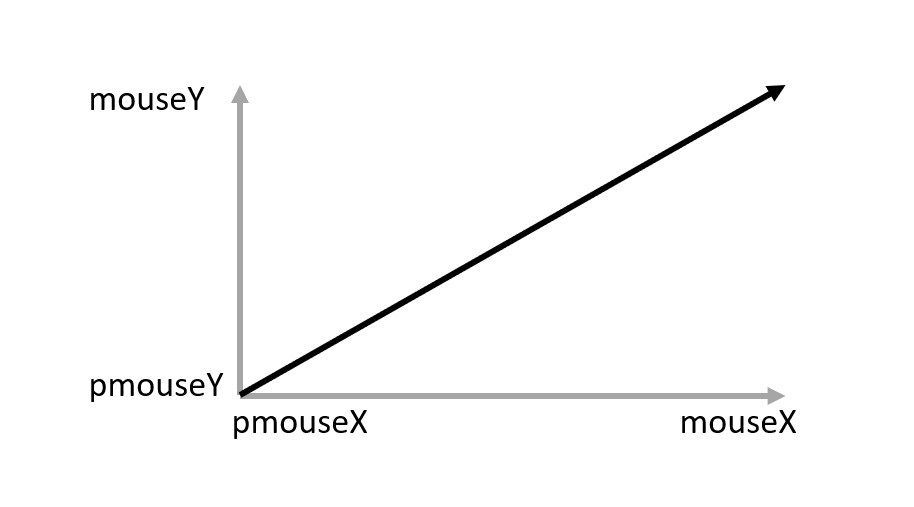

Kunst maken in de browser.

<!--more-->

## Introductie

Naast kunst met [Scratch](/instructies/scratch-art/) en [Python](/instructies/python-art/), kun je ook kunst 
programmeren met [Processing](https://processing.org/).

Er is ook een Processing variant voor in de browser. Deze heet [p5.js](https://p5js.org/). We gaan er in deze instructie
mee aan de slag. Eerst een voorbeeld van wat je ermee kunt doen:



Favoriet van Jaap! 😉

Kopie van <a href="https://openprocessing.org/sketch/422446">Sketch 422446</a>.

var circle = 200;
var rot;
var col;
var freq = 0.000005;
var cont = 0;
var r;

function setup() {
    createCanvas(600, 600);
}

function draw() {
    background(242);
    translate(300, 300);
    rotate(radians(rot));
    
    ellipseMode(RADIUS);
    for (var i=0; i<500; i ++) {
        circle= 200 + 50*sin(millis()*freq*i);
        col=map(circle,150,250,255,60);
        r=map(circle,150,250,5,2);
        fill(col,0,74);
        noStroke();
        ellipse(circle*cos(i), circle*sin(i),r,r);
        rot=rot+0.00005;
    }
}



### Editor

p5.js is een Javascript bibliotheek. Deze kun je in elke webpagina integreren. Je kunt "sketches" schrijven in een 
editor op je PC en het resultaat dan bekijken in een webbrowser. Het is echter makkelijker om een editor in de browser
zelf te gebruiken. Ga daarvoor naar <a href="p5.js-widget/p5-widget.html" target="_blank">deze editor</a>.

De volgende instructies en voorbeelden gaan ervan uit dat je deze editor gebruikt.

## De basis

p5.js sketches hebben de volgende basis:


function setup() {
}

function draw() {
}


Er zijn twee functies die worden aangeroepen door de p5.js bibliotheek:

- `setup()` wordt éénmaal bij de start van het script uitgevoerd
- `draw()` wordt oneindig herhaald en iedere schermvernieuwing aangeroepen (normaal 60 keer per seconde)

In de `setup()` functie zet je éénmalige instellingen, zoals bijvoorbeeld een vaste achtegrondkleur. In de `draw()`
functie dingen die veranderen, zoals bijvoorbeeld een verschuivende kubus.

Het volgende voorbeeld tekent een draaiend vierkant:


function setup() {
    createCanvas(150, 150);
}

function draw() {
    background(255);
    translate(width / 2, height / 2);
    rotate(frameCount/50);
    rect(-26, -26, 52, 52);
}


We zullen stap voor stap door de code heen lopen:

 * op regel 2 in de `setup` functie wordt het tekenblad (canvas) gemaakt. Dit hoeft slechts 1 keer te gebeuren.
 * regels 6 tot en met 9 worden telkens herhaald:
   * `background(255)` maakt de achtergrond kleur wit (waarde 255).
   * `translate(width / 2, height / 2)` zorgt ervoor dat het vierkant midden in het tekenblad komt.
   * `rotate(frameCount / 50)` draait het vierkant iedere keer dat dit wordt uitgevoerd. `frameCount` staat voor het
     aantal schermvernieuwingen per seconde. Daardoor bepaald `frameCount / 50` de snelheid waarmee het vierkant draait.
   * tenslotte tekent `rect(-26, -26, 52, 52)` het vierkant.

**Opdracht 1**: neem de code over in de editor en kijk of er een draaiend vierkant wordt getekend door op de speel knop
    te klikken.  
**Opdracht 2**: vervang waarde 255 op regel 6 eens met een andere waarde tussen 0 en 256. Wat gebeurt er met een lage
    waarde? En wat met een hoge?  
**Opdracht 3**: misschien vraag je je af waarom de achtergrond iedere keer opnieuw moet worden getekend? Door `//` voor
    de regel te zetten, maak je er commentaar van en wordt het niet meer uitgevoerd. Zet `//` voor regel 6. Wat gebeurt
    er?  
**Opdracht 4**: regel 8 zorgt ervoor dat het vierkant draait. Verander waarde 50 eens door 10. Wat gebeurt er? En bij
    een waarde van 100?  
**Opdracht 5**: regel 9 tekent het vierkant. De eerste twee getallen -26 verschuiven het draaipunt van het vierkant
    horizontaal en vertikaal. De twee laatste bepalen de hoogte en breedte. Vervang de getallen 52 eens door 75. Wat
    gebeurt er? En als je één van de twee 52 laat en de ander veranderd naar 75?

Na het uitvoeren van deze eerste opdrachten begrijp je een beetje hoe het werkt. In de volgende hoofdstukken gaan we 
verder met meer voorbeelden en uitleg.

## Cirkels en muis

In dit hoofdstuk gaan we kunst maken met je muis. Beweeg je muis maar eens over het grijze vlak hieronder. 😉

Stap voor stap gaan we dit nabouwen.

### Tekenvlak

We beginnen met het vlak waarin we de cirkels gaan tekenen:


function setup() {
    createCanvas(710, 400);
    background(102);
}

function draw() {
}


**Opdracht 6**: neem bovenstaande code over in de editor en voer het programma uit. Je hebt nu een grijs vlak.

### Een cirkel

De volgende stap is een cirkel:


function setup() {
    createCanvas(710, 400);
    background(102);
}

function draw() {
    ellipse(300, 200, 60, 60);
}


**Opdracht 7**: neem regel 7 over in je code en voer het programma uit. Er verschijnt nu een witte cirkel in het grijze 
    vlak. Wat gebeurt er als je de getallen 300 en 200 veranderd? En als je de getallen 60 veranderd?

### De cirkel bewegen met de muis

Om de cirkel te bewegen met de muis, moet je er voor zorgen dat de cirkel de positie van de muis volgt:


function setup() {
    createCanvas(710, 400);
    background(102);
}

function draw() {
    ellipse(mouseX, mouseY, 60, 60);
}


**Opdracht 8**: vervang de getallen 300 en 200 in regel 7 met `mouseX` en `mouseY`. Deze twee variabelen bevatten de 
    horizontale positie (`mouseX`) en vertikale positie (`mouseY`) van de muis. Voor je programma uit. Beweegt de
    cirkel mee?

### Een kleurtje voor de cirkel

Het voorbeeld heeft een gekleurde cirkel. Laten we eens een kleurtje toevoegen:


function setup() {
    createCanvas(710, 400);
    background(102);
}

function draw() {
    fill(color(255, 128, 0));
    ellipse(mouseX, mouseY, 60, 60);
}


**Opdracht 9**: voeg regel 7 toe aan je code. Welke kleur heeft de cirkel?

Het commando `fill()` vult het figuur dat erna wordt getekend met de kleur die wordt bepaald door het commando `color()`.
Het commando `color()` heeft 3 parameters, een voor rood, een voor groen en een voor blauw. Alle drie de kleuren kunnen
met een getal tussen 0 en 255 worden bepaald. 0 is geen kleur en 255 is maximaal kleur. `color(0, 0, 0)` komt daarmee
overeen met zwart en `color(255, 0, 0)`  met helder rood.

**Opdracht 10**: speel met de kleur van de cirkel door met de getallen 255, 128 en 0 op regel 7 te variëren.

### De cirkel grootte afhankelijk van de snelheid

Als je de snelheid van de muis berekent, kun je die gebruiken om de grootte van de cirkel ermee aan te passen:


function setup() {
    createCanvas(710, 400);
    background(102);
}

function draw() {
    let snelheid = abs(mouseX - pmouseX) + abs(mouseY - pmouseY)
    fill(color(255, 128, 0));
    ellipse(mouseX, mouseY, snelheid, snelheid);
}


**Opdracht 11**: voeg regel 7 toe en pas regel 9 aan. Wordt de cirkel groter en kleiner?

Op regel 7 wordt de snelheid van de muis berekend. Wil je daar meer over weten, lees dan door in onderstaande grijze
vak.


#### Hoe bereken je de snelheid van de muis?

Op het moment dat je je muis beweegt, dan beweegt het horizontaal, vertikaal of in beide richtingen als je je muis 
schuin beweegt. Als je je muis langzaam beweegt, dan verschuift het een kleiner stukje per seconde dan als je het 
sneller beweegt. 

De verschuiving die je doet, kun je berekenen door het verschil te bepalen tussen de vorige positie en de huidige. In
p5.js geven `pmouseX` en `pmouseY` de vorige horizontale en vertikale positie en `mouseX` en `mouseY` de huidige.

De horizontale en vertikale verschuiving kun je als volgt tekenen:

Een schuine beweging, zoals getekend in het plaatje, is het resultaat van een horizontale en vertikale verschuiving. 
De lengte van de schuine pijl is dan een maat voor de snelheid. Hoe langer de pijl, hoe groter de verschuiving en dus
hoe groter de snelheid.

De code bevat een berekening voor de maat van de snelheid (niet 100% correct, maar voldoende voor dit doel). Het telt
de horizontale verschuiving (`abs(mouseX - pmouseX`) op bij de vertikale verschuiving (`abs(mouseY - pmouseY`)).


### De kleur afhankelijk van de snelheid

Naast de grootte van de cirkel is ook de kleur in het voorbeeld afhankelijk van de snelheid van de muis.
We hebben de snelheid al berekend, nu gaat we die gebruiken bij het inkleuren van de cirkel:


function setup() {
    createCanvas(710, 400);
    background(102);
}

function draw() {
    let snelheid = abs(mouseX - pmouseX) + abs(mouseY - pmouseY)
    let kleur = color(255 - snelheid, snelheid, 128 + snelheid)
    fill(kleur)
    ellipse(mouseX, mouseY, snelheid, snelheid);
}


Met het commando `color` op regel 8 kunnen we een kleur maken. Het commando heeft 3 parameters. Het eerste bepaald de
hoeveelheid rood (R), het tweede de hoeveelheid groen (G) en het derde en laatste de hoeveelheid blauw (B). Deze RGB
waarde zorgt samen een mengsel van de drie kleuren. Daarbij zorgt `color(255, 255, 255)` voor wit (alle kleuren maximaal)
en `color(0, 0, 0)` voor zwart (alle kleuren uit).

In het voorbeeld wordt voor rood de snelheid van 255 afgetrokken. Dus, hoe sneller de muis beweegt, hoe minder rood er
in de kleur zit. Bij de middelste kleur, groen, is hoeveelheid direct afhankelijk van de snelheid. Hoe sneller, hoe meer
groen er in de kleur zit. Tenslotte zit er bij blauw een minimum van 128 in de kleur en neemt de hoeveelheid blauw toe
als de snelheid van de muis toeneemt.

Tenslotte wordt de cirkel ingekleurd met het commando `fill(kleur)`.

**Opdracht 12**: wissel de berekening per kleur eens met een andere kleur. Dus bijvoorbeeld `255 - snelheid` voor
    groen in plaats van voor rood. Welke kleuren krijg je?

## Game met P5.js
We hebben gezien dat we hele mooie kunst kunnen maken. Ook hebben we programma's gemaakt waar we zelf iets kunnen besturen, bijvoorbeeld met de muis. 
Nu hebben we alle ingrediënten om ook games te gaan bouwen!

In de volgende instructies ga je een spel maken waar je op doelwitten moet klikken. De doelwitten verdwijnen langzaam, en als je te langzaam bent verlies je. Het doel is om zoveel mogelijk doelwitten aan te klikken voordat je verliest!

**Opdracht 13**
We maken een canvas van 400 bij 400 pixels.

function setup() {
    createCanvas(400, 400);
}

function draw() {
    background(255);
}


**Opdracht 14**
We moeten bijhouden wat er in ons spel gebeurt, zo willen we weten hoeveel levens de speler nog heeft. Hoe snel de doelwitten krimpen en welke doelwitten we allemaal hebben. 


let doelwitten = []
let levens = 5;
let spelerIsDood = false;
let krimpSnelheid = 0.1;

function setup() {
  createCanvas(400, 400);
}
function draw() {
    background(255);
}


**Opdracht 15**
Het is handig als de speler weet hoeveel levens hij nog heeft. Laten we dat toevoegen. Zoals je kan zien wordt de tekst getekend 20 pixels van links, en 20 pixels vanaf boven. Probeer dit zelf maar te veranderen. 


let doelwitten = []
let levens = 5;
let spelerIsDood = false;
let krimpSnelheid = 0.1;

function setup() {
  createCanvas(400, 400);
}
function draw() {
    background(255);
    text("Levens: "+str(levens), 20, 20, 100, 100);
}


**Opdracht 16**
Laten we wat doelwitten te voorschijn toveren. Onze doelwitten worden cirkels. We zullen dus de ellipse functie gebruiken. 

We hebben eerder al een lijst met doelwitten gemaakt (de eerste regel). We gaan nu door elk doelwit heen en tekenen die op het scherm. Dit doet wij met een for loop:


for (var i = doelwitten.length-1; i >= 0; i--) {
        t = doelwitten[i];
        
        //Teken alle doelwitten
        ellipse(t.x, t.y, t.r, t.r);  
}


Je code zal er dan zo uit moeten zien als volgt. Dit is een lastig stuk dus als je hier vragen over hebt, stel ze vooral!



let doelwitten = []
let levens = 5;
let spelerIsDood = false;
let krimpSnelheid = 0.1;

function setup() {
  createCanvas(400, 400);
}
function draw() {
    background(255);
    text("Levens: "+str(levens), 20, 20, 100, 100);

    for (var i = doelwitten.length-1; i >= 0; i--) {
        t = doelwitten[i];
        
        //Teken alle doelwitten
        ellipse(t.x, t.y, t.r, t.r);    
    }  
}


**Opdracht 17**
je zult zien dat er nog niks getekend wordt. Dit komt omdat we nog geen doelwitten hebben toegevoegd aan onze lijst. Dit doen we als volgt



let doelwitten = []
let levens = 5;
let spelerIsDood = false;
let krimpSnelheid = 0.1;

function setup() {
  createCanvas(400, 400);

 //voeg begin doelwitten toe
  doelwitten.push({x: random(300), y: random(300), r: 50}) //Voeg een doelwit toe op een nieuwe willekeurige plek.
  doelwitten.push({x: random(300), y: random(300), r: 50}) //Voeg een doelwit toe op een nieuwe willekeurige plek.
  doelwitten.push({x: random(300), y: random(300), r: 50}) //Voeg een doelwit toe op een nieuwe willekeurige plek.
  doelwitten.push({x: random(300), y: random(300), r: 50}) //Voeg een doelwit toe op een nieuwe willekeurige plek.
  doelwitten.push({x: random(300), y: random(300), r: 50}) //Voeg een doelwit toe op een nieuwe willekeurige plek.
}
function draw() {
    background(255);
    text("Levens: "+str(levens), 20, 20, 100, 100);

    for (var i = doelwitten.length-1; i >= 0; i--) {
        t = doelwitten[i];
        
        //Teken alle doelwitten
        ellipse(t.x, t.y, t.r, t.r);    
    }  
}


**Opdracht 18**
Cool! Maar er gebeurt nog niks. We voegen een regel toe zodat de doelwitten langzaam gaan krimpen. 


function draw() {
    background(255);
    text("Levens: "+str(levens), 20, 20, 100, 100);

    for (var i = doelwitten.length-1; i >= 0; i--) {
        t = doelwitten[i];
        
        //Teken alle doelwitten
        ellipse(t.x, t.y, t.r, t.r);    

        //Krimp alle doelwitten
        t.r -= krimpSnelheid; 
    }  
}


**Opdracht 19**
Als je het programma nu draait en lang genoeg wacht, zullen de cirkels verdwijnen. En daarna weer terugkomen!. Dit gebeurt om dat de groote van cirkel negatief wordt na een tijdje. De computer interpreteert dit echter als een positief getal. We moeten dus het doelwit weggooien als hij te klein is. 

Dan doen we met deze code:


function draw() {
    background(255);
    text("Levens: "+str(levens), 20, 20, 100, 100);

    for (var i = doelwitten.length-1; i >= 0; i--) {
        t = doelwitten[i];
        
        //Teken alle doelwitten
        ellipse(t.x, t.y, t.r, t.r);    

        //Krimp alle doelwitten
        t.r -= krimpSnelheid; 

        //verwijder te kleine doelwitten
        if(t.r < 0) { //Is de grote kleiner dan 0? Dan verwijderen
            doelwitten.splice(i, 1); //Haal het doelwit uit de lijst.
            doelwitten.push({x: random(300), y: random(300), r: 50}) //Voeg een doelwit toe op een nieuwe willekeurige plek.
        }
    }  
}


**Opdracht 20**
De volgende stap is programmeren dat je op doelwitten kan klikken. Dat doen we als volgt. De functie mouseClicked() wordt aangeroepen wanneer je klikt. Plaats deze functie helemaal onderaan het bestand. Probeer elke regel te begrijpen!


function mouseClicked() {
  for (var i = doelwitten.length-1; i >= 0; i--) {
    t = doelwitten[i];
    
    //Bereken de afstand tussen de muis en het doelwit
	let afstand = dist(mouseX, mouseY, t.x, t.y);

    if(afstand < t.r/2) { //Als de afstand kleiner is dan de halve radius van het doelwit is het raak
      doelwitten.splice(i, 1); //Verwijder het doelwit dat geraakt is
      doelwitten.push({x: random(300), y: random(300), r: 50}) //Voeg een doelwit toe op een nieuwe willekeurige plek.
      return;
    }
  }
}


**Opdracht 21**
Wat nu? De speler kan nog niet verliezen. We voegen toe dat de speler een leven verliest als een doelwit verdwijnt waar hij niet op klikt.


function draw() {
    background(255);
    text("Levens: "+str(levens), 20, 20, 100, 100);

    for (var i = doelwitten.length-1; i >= 0; i--) {
        t = doelwitten[i];
        
        //Teken alle doelwitten
        ellipse(t.x, t.y, t.r, t.r);    

        //Krimp alle doelwitten
        t.r -= krimpSnelheid; 

        //verwijder te kleine doelwitten
        if(t.r < 0) { //Is de grote kleiner dan 0? Dan verwijderen
            doelwitten.splice(i, 1); //Haal het doelwit uit de lijst.
            doelwitten.push({x: random(300), y: random(300), r: 50}) //Voeg een doelwit toe op een nieuwe willekeurige plek.
            levens--;
        }
    }  
}

**Opdracht 22**
Als laatste: we laten de speler weten wanneer hij verloren heeft met de volgende code:


function draw() {
    background(255);
    text("Levens: "+str(levens), 20, 20, 100, 100);

    if(spelerIsDood) {
        textSize(52);
        text("Dood!", 130, 170, 100, 100);
        textSize(32);
        return; 
    }

    for (var i = doelwitten.length-1; i >= 0; i--) {
        t = doelwitten[i];
        
        //Teken alle doelwitten
        ellipse(t.x, t.y, t.r, t.r);    

        //Krimp alle doelwitten
        t.r -= krimpSnelheid; 

        //verwijder te kleine doelwitten
        if(t.r < 0) { //Is de grote kleiner dan 0? Dan verwijderen
            doelwitten.splice(i, 1); //Haal het doelwit uit de lijst.
            doelwitten.push({x: random(300), y: random(300), r: 50}) //Voeg een doelwit toe op een nieuwe willekeurige plek.
            levens--;
        }
    }  

    if(levens <= 0) {
        spelerIsDood = true;
    }
}


**Afronden**
Als het goed is heb je nu een spel gemaakt. Werkt het niet? Je kan jouw code vergelijken met de uitwerking hieronder. 



let doelwitten = []
let levens = 5;
let spelerIsDood = false;
let krimpSnelheid = 0.1;

function setup() {
  createCanvas(400, 400);

 //voeg begin doelwitten toe
  doelwitten.push({x: random(300), y: random(300), r: 50}) //Voeg een doelwit toe op een nieuwe willekeurige plek.
  doelwitten.push({x: random(300), y: random(300), r: 50}) //Voeg een doelwit toe op een nieuwe willekeurige plek.
  doelwitten.push({x: random(300), y: random(300), r: 50}) //Voeg een doelwit toe op een nieuwe willekeurige plek.
  doelwitten.push({x: random(300), y: random(300), r: 50}) //Voeg een doelwit toe op een nieuwe willekeurige plek.
  doelwitten.push({x: random(300), y: random(300), r: 50}) //Voeg een doelwit toe op een nieuwe willekeurige plek.
}

function draw() {
    background(255);
    text("Levens: "+str(levens), 20, 20, 100, 100);

    if(spelerIsDood) {
        textSize(52);
        text("Dood!", 130, 170, 100, 100);
        textSize(32);
        return; 
    }

    for (var i = doelwitten.length-1; i >= 0; i--) {
        t = doelwitten[i];
        
        //Teken alle doelwitten
        ellipse(t.x, t.y, t.r, t.r);    

        //Krimp alle doelwitten
        t.r -= krimpSnelheid; 

        //verwijder te kleine doelwitten
        if(t.r < 0) { //Is de grote kleiner dan 0? Dan verwijderen
            doelwitten.splice(i, 1); //Haal het doelwit uit de lijst.
            doelwitten.push({x: random(300), y: random(300), r: 50}) //Voeg een doelwit toe op een nieuwe willekeurige plek.
            levens--;
        }
    }  

    if(levens <= 0) {
        spelerIsDood = true;
    }
}


## Verbeter het spel
We hebben zojuist een spel gemaakt. Kan jij het beter maken?
Probeer de volgende ideeën toe te voegen:
- Geef de doelwitten mooie kleuren. Kan jij de kleur mee laten veranderen met de grote?
- Voeg tekst toe die jouw score laat zien. Laat aan andere zien wat jouw record is. 
- Vind je het spel te makkelijk of moeilijk? Pas de hoeveelheid doelwitten of krimpsnelheid aan! 

## Tot slot

De instructie geeft je slechts een introductie van wat er mogelijk is met de p5.js bibliotheek. Naast tekenen kun je
ook met geluid werken of foto's en filmpjes.

Zie https://p5js.org/examples/ voor een overzicht van voorbeelden. 

Een aantal voorbeelden die we zelf leuk vinden:

 * https://p5js.org/examples/math-parametric-equations.html
 * https://p5js.org/examples/math-graphing-2d-equations.html
 * https://p5js.org/examples/math-distance-2d.html
 * https://p5js.org/examples/sound-playback-rate.html (zet je luidsprekers aan!)
 * https://p5js.org/examples/sound-oscillator-frequency.html (zet je luidsprekers aan!)


